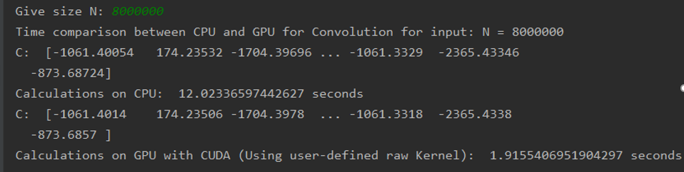

# one-dimensional-convolution
1-D convolution implementation using Python and CUDA, implemented as a Signals and Systems university project.

This work in the Systems Signals course deals with the implementation of convolution algorithms where they also run on an Nvidia graphics card with the help of CUDA in a Python environment.
Implemented using Python version 3.7.5.
To make it easier for you to use the libraries I have included to run the program, I encourage you to import the environment file included through the Anaconda software. A file on how to import and run a project through Anaconda is also included.

## Convolution Algorithm Used
In order to avoid using the O(n^2) algorithm of the original definition, the method used is described as below:

It is known that another way to get the convolution of two signals is to first calculate the Fourier transform of each signal, and then their product will lead to the transformation of the requested convolution. Finally with a calculation of the inverse Fourier we will get the output of the convolution is needed.
Through fast algorithms for calculating the Fourier transform of a discrete sequence (eg Cooley-Tukey), we can calculate the transformation with time complexity of O(nlogn).
With this method the calculation of the a convolution algorithm totally takes O(nlogn), since we will essentially need to do the transformation three times and a simple element-by-element multiplication.

## Python code files
Each .py file runs a separate task. The code itself is well commented and explains the methods/processes.
### A1.py
- Creates a vector (random float array) of random numbers A of length N> 10, where N input will be requested by the user, which is then convoluted with the vector: `[0.2 0.2 0.2 0.2 0.2]`.
### A2.py
- Calculates the result of the convolution between the given sample_audio.wav and pink_noise.wav audio files and writes it to the new pinkNoise_sampleAudio.wav audio file.
- Creates a white noise signal, then caulates the effect of its convolution with sample_audio.wav and writes it to the new whiteNoise_sampleAudio.wav audio file.
### B.py
- Runs a convolution function in a version that runs on an Nvidia graphics card with the help of CUDA. The CUDA implementation used Python's CuPy library in conjunction with a user-defined CUDA kernel, which requires a small C / C ++ snippet of code that CuPy automatically collects and synthesizes to create a CUDA binary.

### MyFunctions.py.
- The functions of the convolutions  for A and B are implemented in this file.

## CPU / GPU test run comparison
### A test was conducted with a vector of 8 000 000 random elements.

The file that were convoluted required about `12 seconds` in Python and just `1.9 seconds` in CUDA.
This is because the process of operations that can be done in parallel on a graphics card is more efficient.

### Specifications used for the test:
- CPU: IntelCore - Kabylake Core i5-7300HQ @ 2500 MHz
- GPU: GTX 1050 with 2GB GDDR5
- RAM:  8 GB DDR4 @ 2400 MHz
